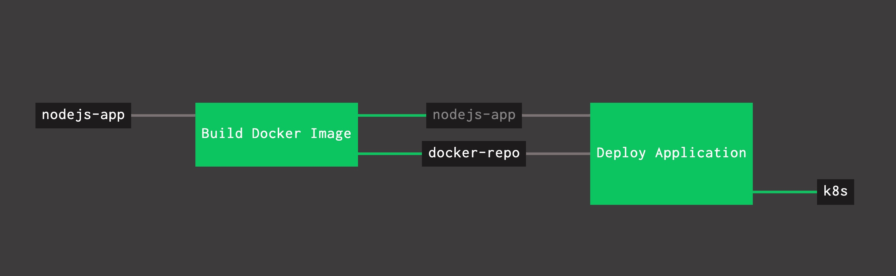

# Example of PKS based application deployment using Concourse

Base application to demonstrate PKS and Concourse pipelines

## Functionality:
- In order to create Docker images, the pipeline is assuming that you have a `Dockerfile` in your repo.
- The `kubernetes apply` is assuming you have a `deployment.yaml` in your repo.

## Building the docker image locally
- You can repurpose `Dockerfile` to fit your needs in terms of base image location and/or different set of scripts
- `git clone` this repo and from the cloned repo folder, execute:
```
git clone https://github.com/sharadg/hello-world-nodejs
cd hello-world-nodejs
docker build -t hello-world-nodejs:latest -f Dockerfile .
```
- Optionally, you can tag the docker image and push it to docker hub or Harbor registry
```
docker tag hello-world-nodejs:latest <harbor_repo_location>/library/hello-world-nodejs:latest
docker push <harbor_repo_location>/library/hello-world-nodejs:latest
# OR
docker tag hello-world-nodejs:latest <docker_hub_username>/hello-world-nodejs:latest
docker push <docker_hub_username>/hello-world-nodejs:latest
```
- Before deploying on k8s, confirm the location of image specified in `deployment.yaml` to make sure your k8s environment can access the harbor repo or docker hub as the case may be:
```
    spec:
      containers:
        - name: nodejs-app
          image: shagupta/hello-world-nodejs:latest
          imagePullPolicy: Always
```
- Using `kubectl`, you can then deploy the app on PKS or on locally running minikube:
```
kubectl apply -f deployment.yaml
kubectl get all

# If you are using minikube, you can find out the exposed service location
minikube service list 
# OR
minikube service nodejs-app-np --url
```

## Using the example pipeline
- Create/populate a `variables.yml` file in your `ci` folder that holds credentials/locations for Docker hub or Harbor registry, and credentials for `pks login` and `pks get-credentials`
- `fly` the pipeline using
```
fly -t <concourse-target> set-pipeline -p <pipeline_name> -c ci/pipeline.yml -l ci/variables.yml
```



## Credits
- I learned a lot from this blog post [on deployment pipeline with kubernetes and concourse](https://blog.alterway.fr/en/building-a-continious-deployment-pipeline-with-kubernetes-and-concourse-ci.html)
- As well as the [kubernetes-resource](https://github.com/zlabjp/kubernetes-resource) for concourse and the sample usage
